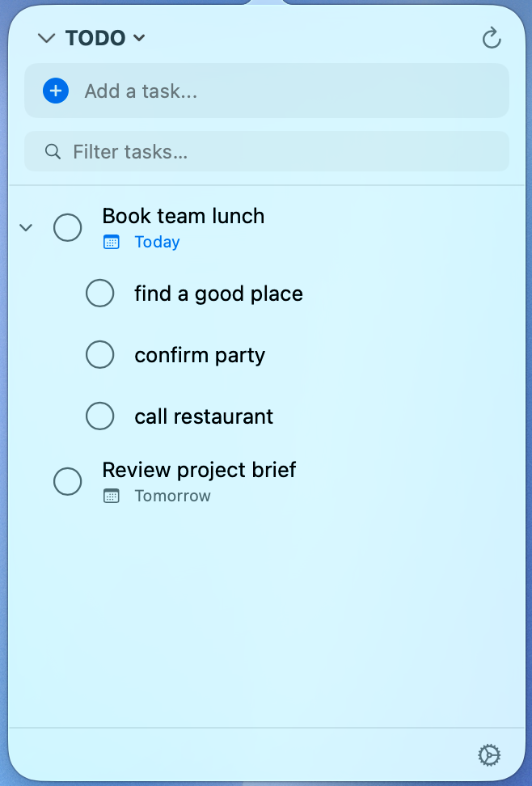
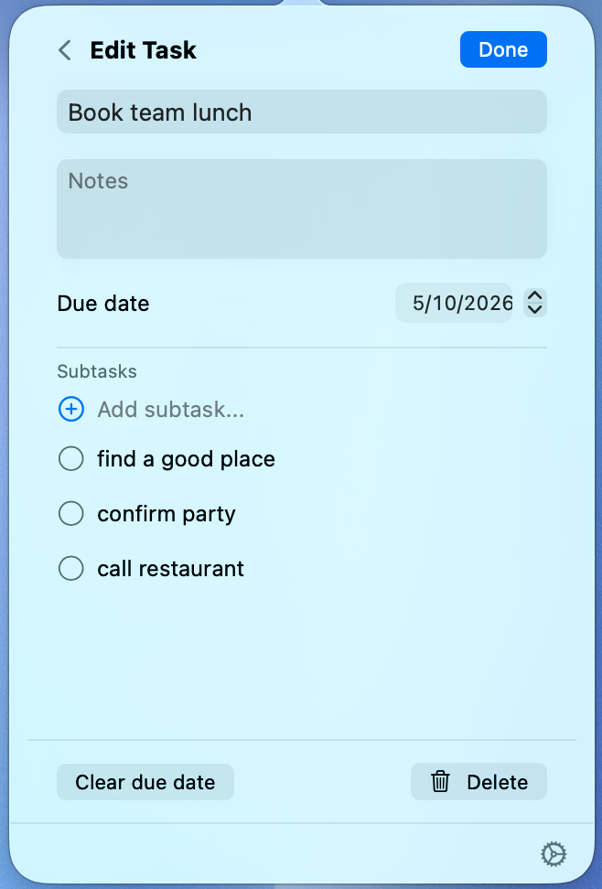

# TaskMenu

> A lightweight, native macOS menu bar app for Google Tasks.

TaskMenu brings Google Tasks to the macOS menu bar with a fast, native SwiftUI interface. It stays out of the Dock, opens as a compact popover, and keeps everyday task management close without pulling you out of your work.

<p align="center">
  
  
</p>

## Links

- Website: [taskmenu.crazytan.dev](https://taskmenu.crazytan.dev/)
- Privacy Policy: [taskmenu.crazytan.dev/privacy](https://taskmenu.crazytan.dev/privacy)
- Support: [GitHub Issues](https://github.com/crazytan/TaskMenu/issues)

## Features

- Menu bar-first design with no Dock icon or main window in normal launches
- Google sign-in with OAuth 2.0 and PKCE
- Quick add, inline filtering, list switching, and refresh from the popover
- Create, edit, complete, and delete Google Tasks
- Due dates, subtasks, and local due-date reminders
- Secure token storage in the macOS Keychain
- Optional launch at login

## Requirements

To run TaskMenu:

- macOS 14.4 or later (Sonoma)

To build from source:

- Xcode 16 or later
- XcodeGen
- A Google Cloud project with the Google Tasks API enabled
- Google OAuth iOS credentials for the app bundle ID

## Installation

Download the signed and notarized DMG from the [latest GitHub release](https://github.com/crazytan/TaskMenu/releases).

## Build From Source

1. Clone the repository:

   ```bash
   git clone https://github.com/crazytan/TaskMenu.git
   cd TaskMenu
   ```

2. Create or configure a Google Cloud project:

   - Enable the Google Tasks API
   - Create an iOS OAuth client in Google Cloud Console for bundle ID `dev.crazytan.TaskMenu`

3. Copy the example config and add your Google OAuth credentials:

   ```bash
   cp Config.xcconfig.example Config.xcconfig
   ```

   Fill in `GOOGLE_CLIENT_ID` and `GOOGLE_REDIRECT_SCHEME` in `Config.xcconfig`.

4. Generate the Xcode project:

   ```bash
   xcodegen generate
   ```

5. Open `TaskMenu.xcodeproj` in Xcode and build the app.

## Development

- Swift 6
- SwiftUI
- XcodeGen-generated project
- Apple frameworks only, with zero third-party dependencies
- Strict concurrency enabled

Run a focused test slice with:

```bash
xcodebuild test -project TaskMenu.xcodeproj -scheme TaskMenu \
  -configuration Debug \
  -only-testing:TaskMenuTests/AppStateTests
```

## Contributing

Contributions are welcome. If you have a bug report, feature request, or a focused improvement, open an issue or submit a pull request.

Issues and feature requests: [GitHub Issues](https://github.com/crazytan/TaskMenu/issues)

Maintainer release instructions live in [docs/RELEASING.md](docs/RELEASING.md).

## License

GNU GPLv3
